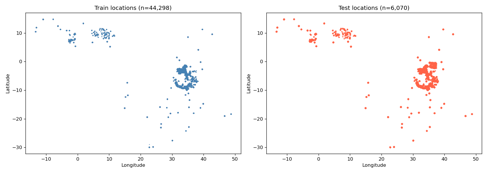
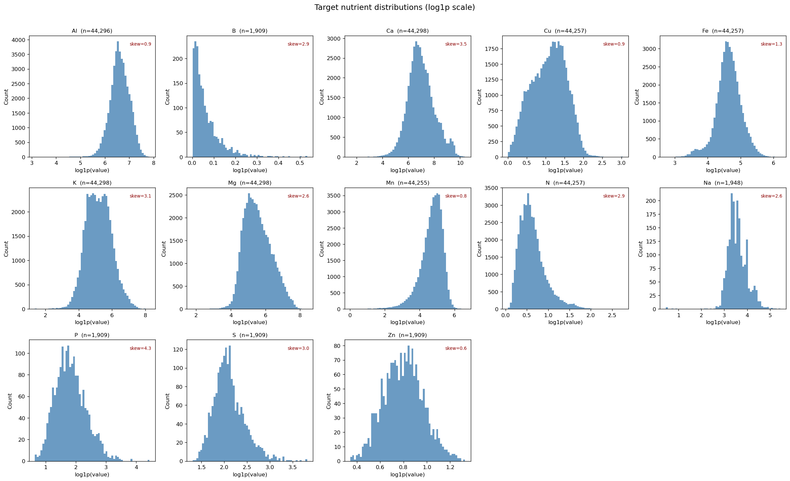
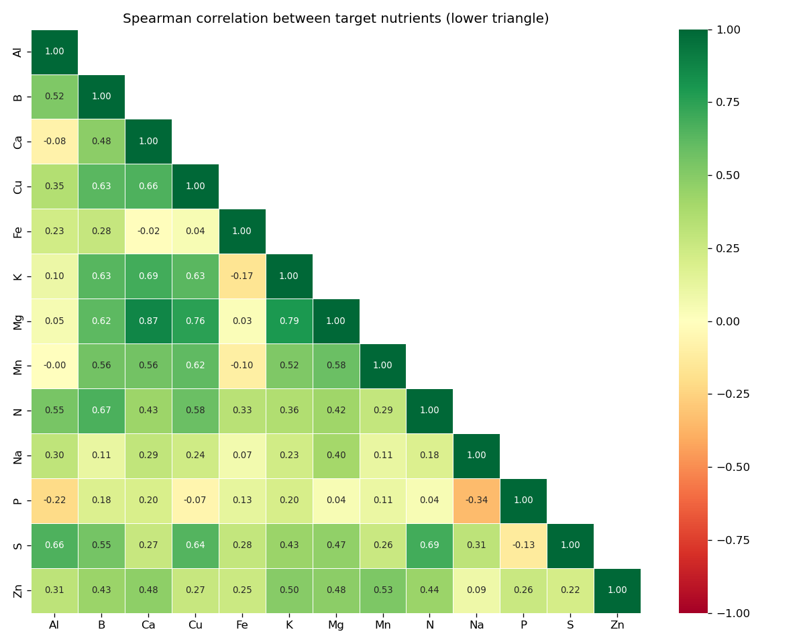
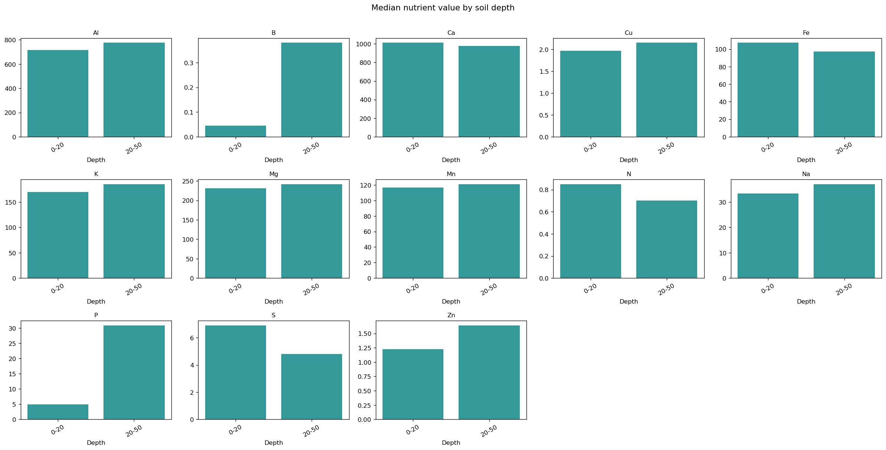
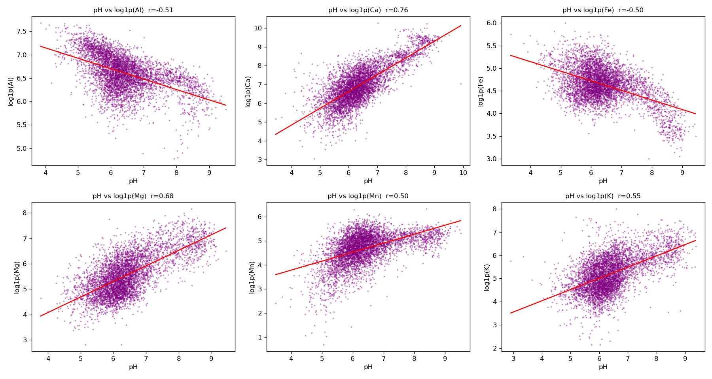
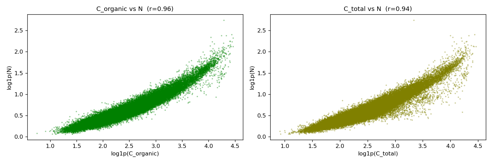
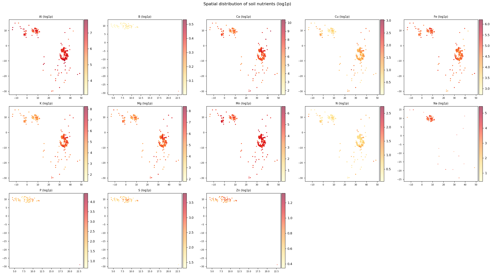

# Rhea Soil Nutrient Prediction Challenge

A reproducible machine learning pipeline for predicting 13 soil nutrient concentrations across Africa using tabular soil chemistry, remote sensing, and environmental covariates.



## Project Summary

- **Goal:** Predict 13 soil nutrient concentrations for test locations using tabular soil data, remote sensing features, and environmental covariates.
- **Targets:** `Al`, `B`, `Ca`, `Cu`, `Fe`, `K`, `Mg`, `Mn`, `N`, `Na`, `P`, `S`, `Zn`
- **Metric:** RMSE averaged across all nutrients.
- **Masking rule:** `TargetPred_To_Keep.csv` identifies which nutrient values may be submitted; masked entries must be forced to zero before submission.

## What’s Included

- `data/raw/`: original competition CSVs
- `data/external/`: downloaded Earth observation and soil grid data
- `outputs/eda_plots/`: EDA visualizations
- `src/`: project scripts for data download, feature engineering, model training, and prediction
- `notebooks/`: exploratory analysis notebooks
- `submissions/`: generated submission files

## Repository Structure

| Path | Purpose |
|---|---|
| `data/raw/` | Competition data inputs (train, test, sample dates, masks) |
| `data/external/` | EO and SoilGrids data caches |
| `src/download_eo_data.py` | Download SoilGrids / WorldClim / Sentinel2-derived features |
| `src/feature_engineering.py` | Create engineered model features from raw + external data |
| `src/train.py` | Train models, generate predictions, and apply submission mask |
| `notebooks/` | Exploratory notebooks and analysis scripts |
| `submissions/` | Final submission files |

## Setup

```bash
pip install -r requirements.txt
```

If you have a Python environment manager available, create and activate a virtual environment first.

## Workflow

### 1. Exploratory Data Analysis

```bash
python notebooks/01_EDA.py
```

Purpose: understand nutrient distributions, missing values, depth patterns, and spatial coverage.

### 2. Download External Data

```bash
python src/download_eo_data.py
```

Purpose: collect auxiliary geospatial information from SoilGrids, WorldClim, and Sentinel-2.

### 3. Feature Engineering

```bash
python src/feature_engineering.py
```

Purpose: merge raw inputs with external covariates, encode depth and temporal variables, create interactions, and save feature datasets.

### 4. Train Models and Generate Submission

```bash
python src/train.py
```

Purpose: train models, predict each nutrient, combine outputs, apply the competition mask, and save a formatted submission.

## Exploratory Analysis Highlights

### Nutrient distributions



### Target correlations



### Depth vs nutrient patterns



### pH relationships



### Carbon vs nitrogen



### Spatial nutrient maps



## Modeling Strategy

### Core approach

1. Train per-target gradient boosting models using LightGBM or XGBoost.
2. Use spatial-aware cross-validation to avoid overfitting to geographic clusters.
3. Stack or blend predictions to capture inter-nutrient relationships.

### Key model features

- Location: `Latitude`, `Longitude`
- Depth features: `Depth_cm`, horizon upper/lower, encoded depth range
- Soil chemistry: `pH`, `electrical_conductivity`, `C_organic`, `C_total`
- EO features: SoilGrids soil properties, WorldClim climate variables, Sentinel-2 spectral indices
- Derived metrics: nutrient ratios, spatial clusters, temporal features, and cross-target predictions

### Recommended validation

- Use `GroupKFold` with spatial blocks or latitude/longitude bins
- Evaluate models on out-of-fold RMSE for each nutrient
- Compare against a simple baseline using only raw train features

## Submission Masking

The final submission must respect the mask in `TargetPred_To_Keep.csv`.

- `1` means keep the prediction
- `0` means force the predicted value to `0`

This step is required after prediction and before writing `submissions/submission_final.csv`.

## Notes & Best Practices

- SoilGrids and WorldClim are high-value external sources for soil and climate context.
- Depth is a strong predictor and should be encoded numerically or with meaningful categories.
- Correlated nutrients like `Ca`/`Mg` and `Fe`/`Mn` benefit from stacked predictions.
- Log-transform skewed target distributions before training, then inverse-transform predictions.

## Example Workflow Table

| Step | Script | Description |
|---|---|---|
| 1 | `notebooks/01_EDA.py` | Data exploration and visualization |
| 2 | `src/download_eo_data.py` | Download external EO and soil grid data |
| 3 | `src/feature_engineering.py` | Build training/test feature datasets |
| 4 | `src/train.py` | Train models, create predictions, apply mask |

## Additional Resources

- `rhea_soil_project_design.md` — detailed project planning and feature/modeling strategy
- `requirements.txt` — Python dependencies for reproducible execution
- `outputs/eda_plots/` — generated exploratory plots

## Contribution

If you want to improve the pipeline:

- add a notebook for additional features or model comparison
- add an evaluation script to compare out-of-fold RMSE per nutrient
- add a prediction script for blended ensemble outputs

---

## License

This project is licensed under the MIT License. See `LICENSE` for details.
